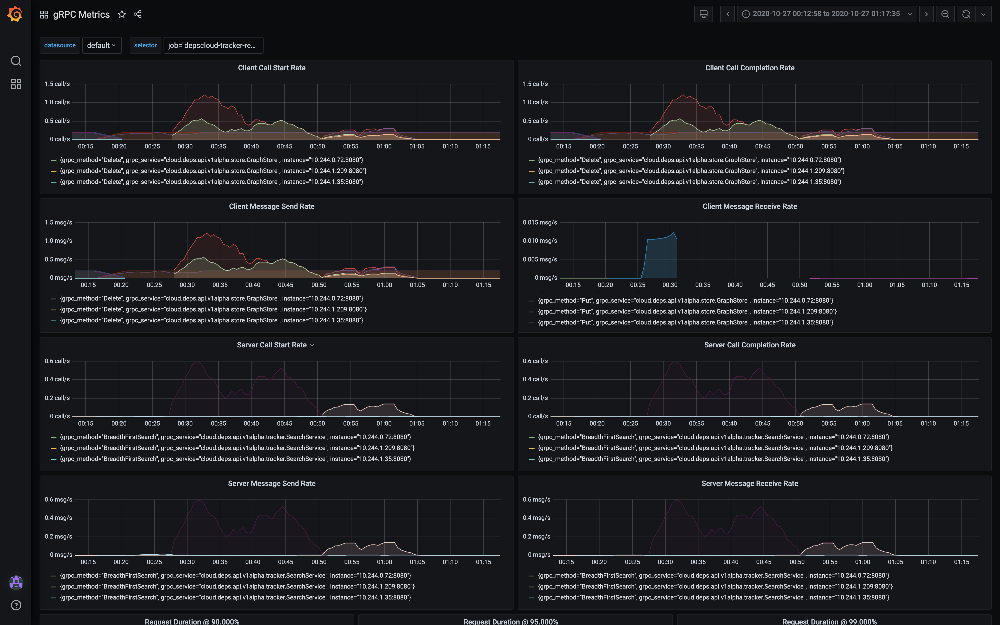

# grpc-jsonnet-lib

A jsonnet library for writing gRPC dashboards as code.
For now, my focus is on the Grafana and Prometheus ecosystem.
I tried to leave room for Datadog.

## gRPC metrics

[ [Dashboard JSON](grpc-metrics/grpc-metrics.json) ]

